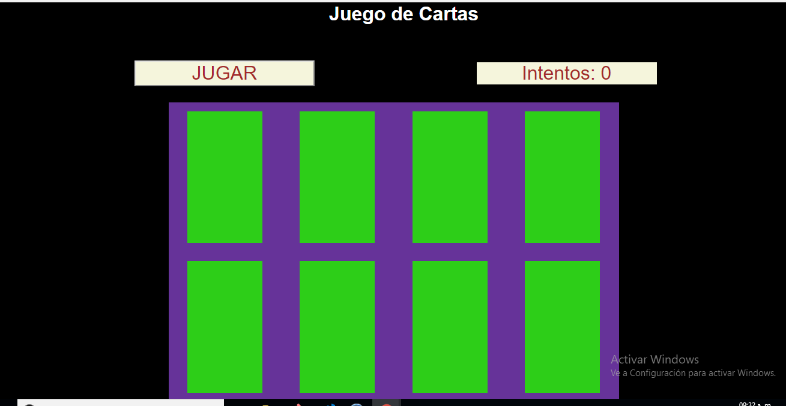
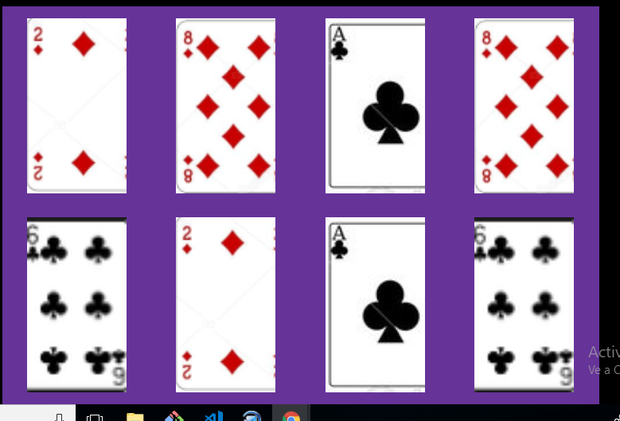
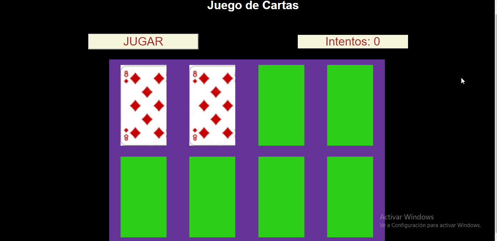

# MEMORY CARDS

## Descripción:

+ Es un juedo de Cartas que ayuda a desarrollar la Memoria.

## Objetivos:
- Mostrar 8 cartas sobre la mesa
  
  

- Las cartas siempre tienen pareja, ningun queda sola.}

   
- Las cartas cargan aleatoriamente, tanto el tipo y número como el orden sobre la mesa.

  Carga aleatoriamente, es necesario renderizar para verificar ello.
   
- Si encontramos un par, las cartas desaparecerán en su mismo sitio sin moverse las demás
- Solo son pares las cartas del mismo número y tipo/palo
- Si se encontraron todos los pares mostrar un mensaje de juego terminado.

## Desarrollado por:

 Nefeli Joñoruco Morales

## Desarrollado para:
 Oechsle